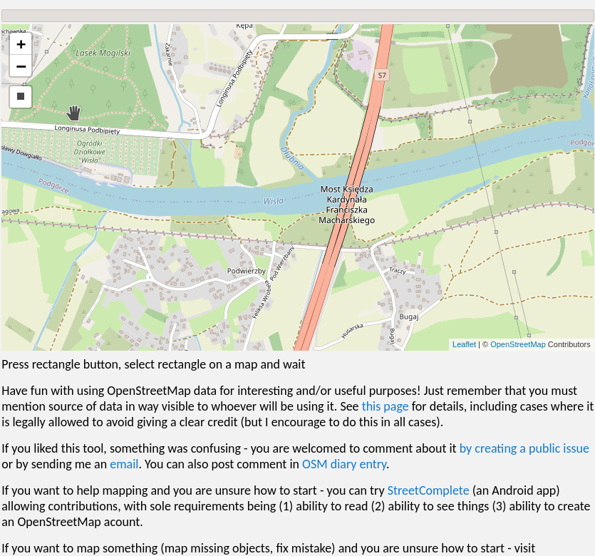
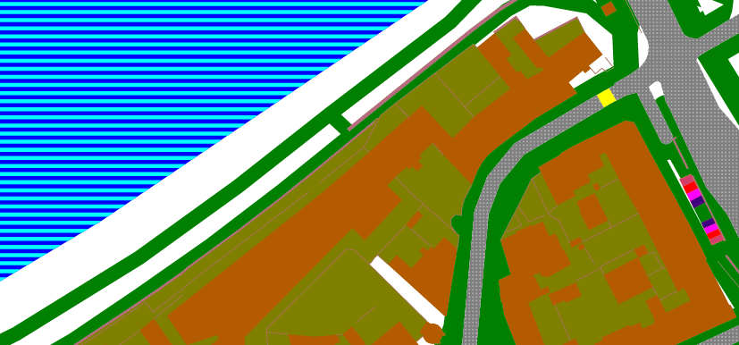
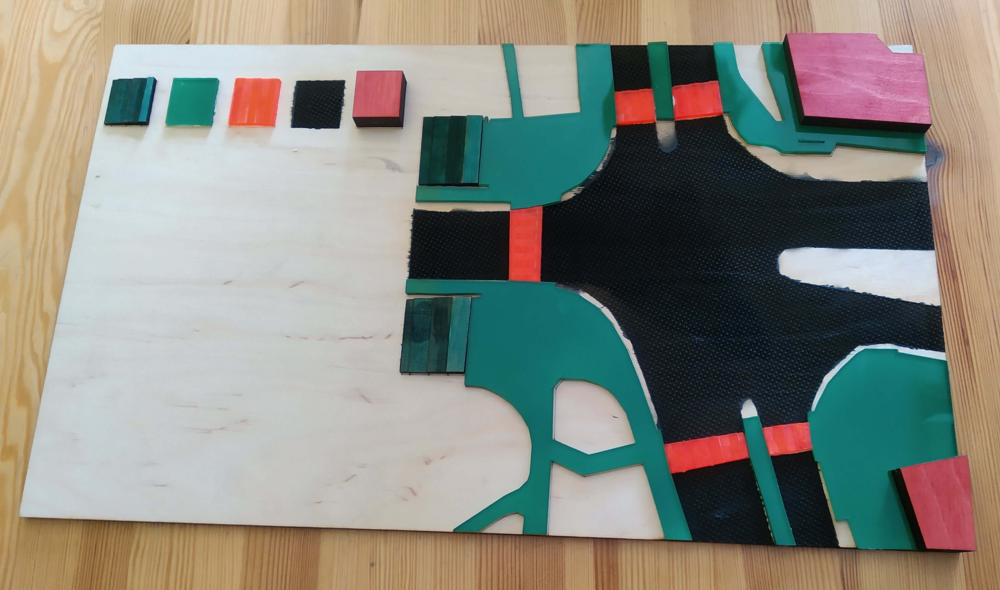
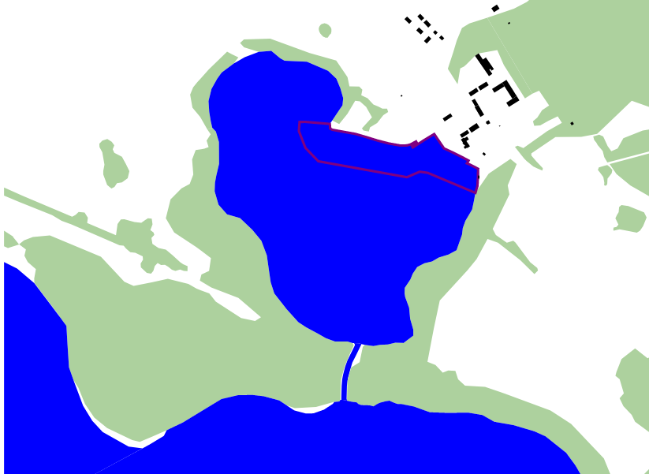

# Lunar assembler

SVG maps from OpenStreetMap data in browser, can be used by marking area on a map. Using it does not require any programming skills.

## In action

### General high zoom map style

[Publicly accessible generation of any location in this map style](https://mapsaregreat.com/osm_to_svg_in_browser/general_high_zoom)

[try it!](https://mapsaregreat.com/osm_to_svg_in_browser/)

### Generating design for laser cut tactile maps

This map styles are designed for used in a laser cutter, to produce maps for blind.

[Ultra-high zoom map for showing a single crossing](https://mapsaregreat.com/osm_to_svg_in_browser/laser_road_area), relying on area:highway.

[high zoom map style for showing neighbourhood, with some attempts to automatically simplify data, no need for area:highway](https://mapsaregreat.com/osm_to_svg_in_browser/laser_neighbourhood).

#### Laser cut 3D tactile map

<!--section above is linked from external document, try to keep the tile -->

3D tactile map for blind children. Teaching aid for orientation lessons - special subject where children learn how to move on their own across the city. This is a map of a specific crossing, nearby their school. Made using this project, this propotype was donated to the school.

Cut using file generated by [map style shown in the section above](https://mapsaregreat.com/osm_to_svg_in_browser/laser_road_area).

 

## How can I use it on my site?

This work is AGPL licensed. This means that you also can use it, with requirement to share your improvements (see license for the full info, this is a single-sentence summary).

[examples](examples) folder contains files necessary to use that in you project:

- `lunar_assembler.dist.js` (build .js file containing all necessary JS code)
- `lunar_assembler.dist.css` (build .js file containing all necessary CSS code)

Feel free to use it in your own projects or build on it!

Pull requests with improvements are also welcomed!

### How can I make own map style?

Map style can be quite simple - just setting colors for lines/areas.

You can make own map style and use it at your own site.

You will need to copy [examples/lunar_assembler.dist.css](examples/lunar_assembler.dist.css) and [examples/lunar_assembler.dist.js](examples/lunar_assembler.dist.js) files and include it in your own site.

Fully functional examples are in an [example](example/) folder.

There is a very simple but also working map style that can show water area, forests, buildings and marinas. See [this simple example](https://github.com/matkoniecz/lunar_assembler/blob/master/examples/simple.html#L59), this page is hosted and shown [here](https://mapsaregreat.com/osm_to_svg_in_browser/simple).

#### Advanced map styles

In some cases one needs to somehow deals with layers. For example, what should be displayed if road in tunnel goes under building? Or under forest? What should be shown if there is a lake in a forest?

The most complex part of default map style is dealing with layers and it is often quite tricky.

Map styles also have access to a powerful functionality allowing complete rewriting of geometries, what is necessary to implement some functionality but typically can be ignored. I used it for example to generate zebra crossing bars on detailed road maps and to generate symbolic representations of steps areas.

### Help!

Note: especially this part of documentation is incomplete and would benefit from better info. Please [open an issue](https://github.com/matkoniecz/lunar_assembler/issues/new) and mention what is confusing and where you are stuck. Right now I am not entirely sure what kind of knowledge people using it will have and what and how should be explained.

## Other published styles

Demonstration of [basic high-zoom map style](https://mapsaregreat.com/osm_to_svg_in_browser/general_high_zoom)

## Architecture

It works in following way

- user selects an area
- Overpass API is called to download OpenStreetMap data in that area
- data is locally processed and rendered

it means that servers only delivers HTML site, code then runs on client. It still needs access to Overpass API but there are generously provided servers allowing some limited use.

### Use on other sites

[current release and (for now only known use of it)](https://mapsaregreat.com/osm_to_svg_in_browser/)

## Potential uses

SVG files may be much more accessible for further processing than alternatives formats of OSM data.

SVG files may be directly usable for some purposes, for example in laser cutters.

## Mentions of use are welcome

In case that you used this code or it inspired you to do something - feel free to create an issue with photo/description of what was produced! Or send an email to [matkoniecz@tutanota.com](mailto:matkoniecz@tutanota.com). It would be nice to have confirmation that publishing it was useful for somebody.

## Improving documentation

Please create a new issue if you want to use it but current instructions are insufficient, wrong or can be in some way improved!

I know that documentation may be far better, but I am not sure what kind of additional documentation would be most useful.

## Alternatives

As usual [OSM Wiki documentation](https://wiki.openstreetmap.org/wiki/SVG#Ways_to_create_an_SVG_map_from_OpenStreetMap) is useful - there are also other ways to [make SVG maps from OpenStreetMap data](https://wiki.openstreetmap.org/wiki/SVG#Ways_to_create_an_SVG_map_from_OpenStreetMap).

[https://touch-mapper.org/en/](Touch Mapper) is another OSM based tool for making tactile maps. It differs by relying on a 3D printing and by more complex infrastructure.

It requires Amazon Web Services to run. Inability to put limit on spending there scared me away from basing my work on it. I do not accept idea that bug in my code may result in a 100 000$ bill that may or may not be waived.

I have run programs that tried to [allocate 4654951TB of memory](https://github.com/a-b-street/abstreet/issues/148) due to a bad configuration and I am scared that Amazon would allow this to happen and then bill me.

[hapticke.mapy.cz](https://hapticke.mapy.cz/?lang=en) may be useful if you need tactile maps.

## Skipped and rejected features

Note that it is basically impossible to make SVGs that would qualify as high-quality cartography here. As reason why this project exists does not require it (generation of laser cutter designs) it was not considered during design and implementation. But feel free to open issues and create pull requests to add missing functionality!

## Sponsors

 

The [OpenStreetMap foundation](https://wiki.osmfoundation.org/wiki/Main_Page) was funding the development of this project in their first round of the [microgrant program](https://wiki.osmfoundation.org/wiki/Microgrants) in 2020. It was done as part of making [tactile maps based on OpenStreetMap data, for blind or visually impaired children](https://wiki.openstreetmap.org/wiki/Microgrants/Microgrants_2020/Proposal/Tactile_maps_for_blind_or_visually_impaired_children) (part of making used tools accessible to other and OpenStreetMap promotion).

If anyone else is also interested in supporting this project via funding - [let me know](mailto:osm-messages@etutanota.com) (opening a new issue is also OK) and it is likely that some way of doing that can be found :)
